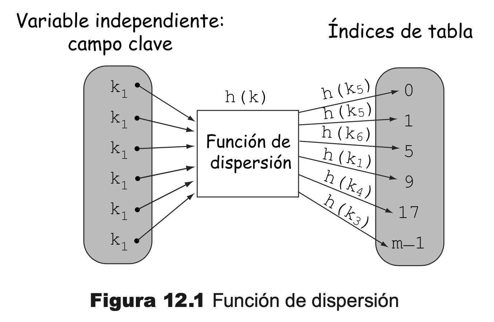
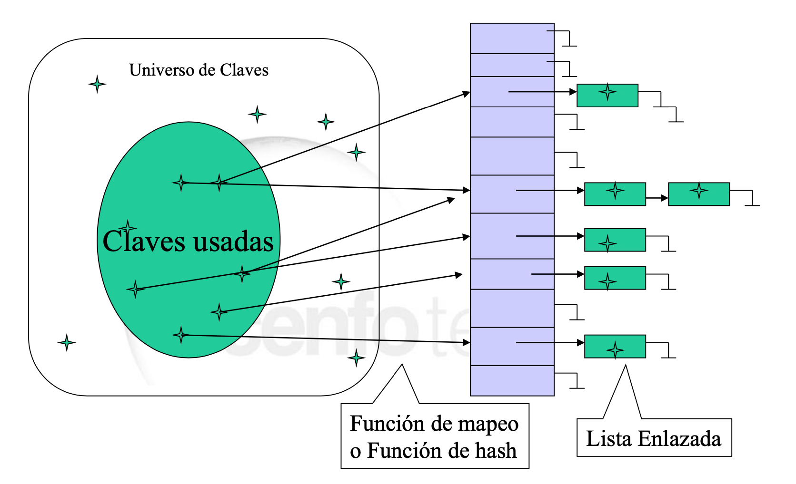
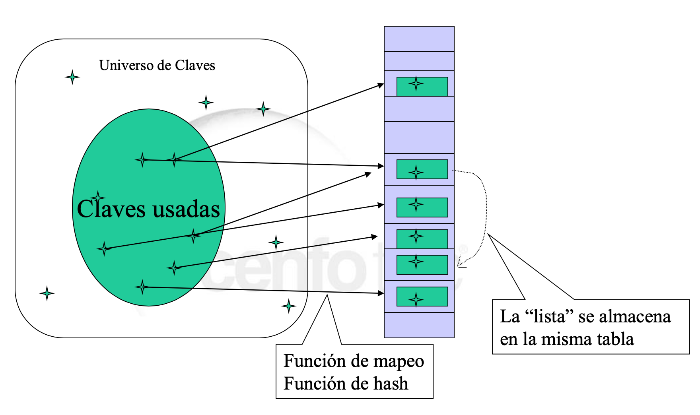
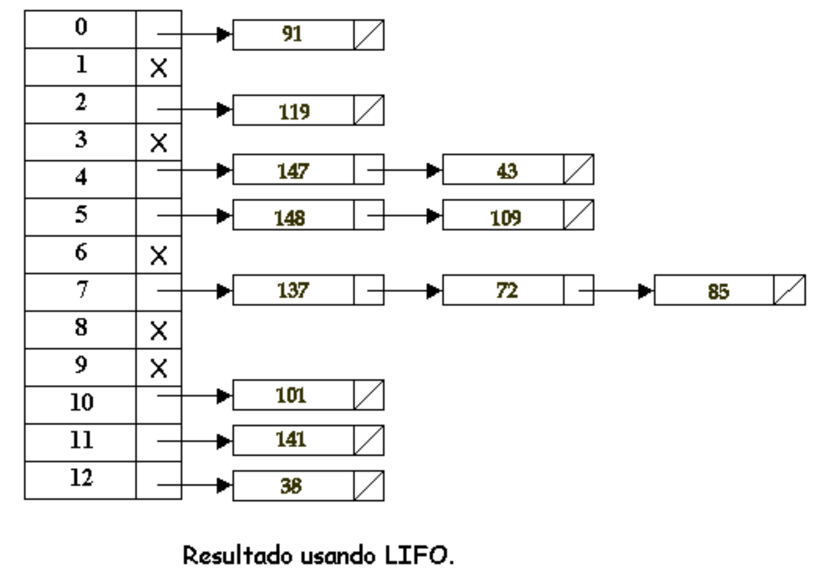

# Hashing

Es un método de transformación de claves (hash), que aumenta la velocidad de búsqueda sin necesidad de tener elementos ordenados. Cuenta también con la ventaja de que el tiempo de búsqueda es prácticamente independiente del número de componentes.

## Introducción
1. Muchas aplicaciones requieren un conjunto dinámico que soporte las operaciones de un diccionario: Insert, Search, Delete.
2. Es posible hacer uso de una lista enlazada con un tiempo O(n) ; sin embargo, este tiempo se puede reducir notablemente a orden O(1) en la mayoría de los casos usando una tabla hash.
3. La idea surge de los arreglos que nos permiten acceso a sus elementos en orden O(1).
4. La idea surge de los arreglos que nos permiten acceso a sus elementos en orden O(1).
5. Otra opción es usar un arreglo menor, al cual podemos mapear las claves en uso. Esta función de mapeo es la _*función hash*_. La tabla así organizada es la _*tabla hash*_.
6. Como es posible que dos claves conduzcan al mismo mapeo (lo cual se conoce como una colisión), es necesario buscar formas para resolver esta situación.
7. Una forma, conocida como hashing abierto, crear una lista asociada a cada entrada del arreglo.
8. Otra forma, conocida como hashing cerrado, almacena las claves en las mismas entradas del arreglo o tabla hash.
## Colisiones
Se define, entonces, una colisión como la asignación de una misma dirección a dos o más claves distintas.

Es decir, dadas dos claves diferentes debe generar posiciones diferentes. Si esto no ocurre (H(K1)=d,H(K2)=d y K1K2), hay una colisión.
## Tablas de dispersión
Las *tablas de dispersión* o, simplemente *tablas hash*, son estructuras de datos que se usan en aplicaciones que manejan una secuencia de elementos, de tal forma que cada elemento tiene asociado un valor clave, que es un número entero positivo perteneciente a un rango de valores, relativamente pequeño.

### Diccionario
Un *diccionario* es un tipo abstracto de datos en el que los elementos tienen asociada una clave única en el conjunto de los números enteros positivos, de tal forma que, para cualquier par de elementos distintos, sus claves son también distintas. Con las tablas de dispersión se implementa eficientemente el tipo abstracto de datos *diccionario*.
### Tabla de dispersión
Las tablas de dispersión son estructuras de datos que tienen como finalidad realizar las operaciones fundamentales de búsqueda y eliminación de un registro en un tiempo de ejecución constante (complejidad constante **O(1)**). La organización ideal de una tabla es de tal forma que el campo clave de los elementos se corresponda directamente con el índice de la tabla.

Las funciones que transforman números grandes en otros más pequeños se conocen como funciones de dispersión o funciones hash.

*Una tabla de dispersión consta de un array (vector), donde se almacenan los registros o elementos, y de una función hash, que transforma el campo clave elegido en el rango entero del array.*


_Imagen tomada de Estructura de datos en java, pag. 343_

La ventaja de utilizar tablas de dispersión radica en la eficiencia de estas operaciones. Si la función hash es de complejidad constante, la complejidad de cada una de las tres operaciones también es constante, *O(1)*. Un problema potencial de la función de dispersión es el de las colisiones, esto es dadas dos claves distintas *xi, xj* se obtenga la misma dirección o índice: *h(xi) = h(xj)*. La operación de insertar tiene que incorporar el proceso de resolución de  colisiones, no pueden estar dos elementos en la misma posición. De igual forma, los procesos de búsqueda y eliminación también quedan afectados por la resolución de colisiones.

Las tablas dispersas se diseñan considerando el problema de las colisiones. Siempre se reservan mas posiciones de memoria, *m*, que elementos previstos a almacenar, *n*. Cuantas más posiciones haya, menor es el riesgo de colisiones, pero mas huecos libres quedan (memoria desaprovechada).

El parámetro que mide la proporción entre el número de elementos almacenados, *n*, en una tabla dispersa y el tamaño de la tabla, *m*, se denomina factor de carga, *λ = n/m*. Se recomienda elegir *m* de tal forma que el factor de carga sea *λ ≤ 0.8*.

### Funciones de dispersión
Una *función de dispersión* convierte el dato considerado campo clave (tipo entero o cadena de caracteres) en un índice dentro del rango de definición del *array* o vector que almacena los elementos, de tal forma que sea adecuado para indexar el *array*.

La idea que subyace es utilizar la clave de un elemento para determinar su dirección o posi- ción en un almacenamiento secuencial, pero sin desperdiciar mucho espacio. Para ello, se realiza una transformación, mediante una función hash, del conjunto *K* de claves sobre el conjunto *L* de direcciones de memoria.
```sh
h(x): K → L
```
Ésta es la función de direccionamiento *hash* o función de dispersión. Si *x* es una clave, enton- ces h(x) se denomina direccionamiento hash de la clave *x*, y además es el índice de la tabla donde se guardará el registro con esa clave. Así, si la tabla tiene un tamaño de *tamTabla = 199*, la función hash que se elija tiene generar índices en el rango *0 ... tamTabla-1*. Si la clave es un

#### Hashing abierto
Consiste en tener una lista de todos los elementos que colisionaron en la misma dirección.



#### Hasing cerrado
Los elementos que colisionan se ubican en otra posición dentro del mismo arreglo.
 
 

#### Funcionas hash
1. Una buena función hash debería satisfacer la suposición de hash uniforme (la mejor distribución posible).
2. Como el recorrido de la función de hash es un número natural, hay que saber interpretar o transformar a número natural tipo de clave.
3. Si se trata de claves enteras, el problema está relativamente resuelto.
4. Si se trata de secuencia de caracteres, strings, se puede interpretar cada carácter como un número en base 128 (los números ASCII van del 0 al 127) y el string completo como un número en base 128. Así por ejemplo la clave pt puede ser transformada a (112*128+116)=14452. ASCII(p)=112 y ASCII(t)=116.

#### Método de división
Consiste en tomar el residuo de la división de la clave entre el numero de componentes del arreglo.

La función hash queda definida por la siguiente formula:
```sh
H(K) = (K mod N) + 1
```
Se recomienda que N sea el numero primo inmediato inferior al numero total de elementos.

#### Método de centro de cuadrados o mitad del cuadrado
Consiste en elevar al cuadrado la clave y tomar los dígitos centrales como dirección. El numero de dígitos a tomar queda determinado por el rango del índice. La función hash que definida por la sig. formula:
```sh
H(K) = digitos_centrales (K^2) + 1
```
El número de dígitos a extraer depende del rango de dispersión que se quiera obtener.

Un problema potencial, al calcular *x^2*, es que sea demasiado grande y exceda el máximo en- tero. Es importante, al aplicar este método de dispersión, utilizar siempre las mismas posiciones de extracción para todas las claves. Ej.

Una vez elevado al cuadrado el valor de la clave, se eligen los dígitos que se encuentran en las posiciones 4, 5 y 6 por la derecha. El valor de esa secuencia es la dirección obtenida al aplicar este método de dispersión.
```sh
Para 245643, h(245643) = 483; paso a paso:
245643 → 2456432 → 60340483449 → (dígitos 4, 5 y 6 por la derecha) 483
Para 245981, h(245981) = 652; paso a paso:
245981 → 2459812 → 60506652361 → (dígitos 4, 5 y 6 por la derecha) 652
Para 257135, h(257135) = 408; paso a paso:
257135→ 2571352 → 66118408225 → (dígitos 4, 5 y 6 por la derecha) 408
```

#### Método de Plegamiento
Consiste en dividir la clave en partes de igual numero de dígitos (la ultima puede tener menos dígitos) y operar con ellas, tomando como dirección los dígitos menos significativos. La operación entre las partes puede hacerse por medio de sumas o multiplicaciones.

La función hash queda definida por la sig. formula:
```sh
H(K) = digmensig ((d1...di) + (di + 1...dj) + ... + (d1...dn)) + 1
```
La operación que se realiza para el cálculo de la función hash desprecia los dígitos mas significativos obtenidos del acarreo, por ejemplo si la clave se va a dividir en dos, tenemos:

```sh
h(245981) = 245 + 981 = 1226 = 226 (se ignora el acarreo 1)
h(257135) = 257 + 135 = 392
```

La técnica de plegar la clave de dispersión se utiliza a menudo para transformar una clave muy grande en otra más pequeña y, a continuación, aplicar la función hash de aritmética modular.
#### Método de truncamiento
Consiste en tomar algunos dígitos de la clave y formar con ellos una dirección. La función hash queda definida por la sig. fórmula:
```sh
H(K) = elegirdigitos (d1,d2...dn) + 1
```
### Comparación entre las funiciones hash
Aunque alguna otra técnica pueda desempeñarse mejor en situaciones particulares, la técnica del residuo de la división proporciona el mejor desempeño.

#### Funciones de hash h(k,i)
Existen al menos dos formas para definir esta función: prueba lineal y doble hashing.
1. Prueba lineal

La función es:
```sh
h(k,i) = (h’(k) +i) mod m
```
Una desventaja de este método es la tendencia a crear largas secuencias de entradas ocupadas, incrementando
el tiempo de inserción y búsqueda.

2. Doble hashing

La función es:
```sh
h(k,i) = (h1(k) + i*h2(k)) mod m
```
Por ejemplo;
La función es:
```sh
h1 = k mod m
h2 = 1 + (k mod (m-1))
```

El estudio del direccionamiento hash implica dos hechos: la elección de funciones hash y resolución de colisiones.

Existe un número considerable de funciones hash. Dos criterios deben considerarse a la hora de seleccionar una función.
1. En primer lugar, que la función, h(x), sea fácil de evaluar (lo que dependerá del campo clave) y que su tiempo de ejecución sea mínimo, de complejidad constante, O(1).
2. En segundo lugar, h(x) debe distribuir uniformemente las direcciones sobre el conjunto L (direcciones de memoria), de forma que se minimice el número de colisiones. Nunca existirá una garantía plena de que no haya colisiones, y más sin conocer de antemano las claves y las direcciones. La experiencia enseña que siempre habrá que preparar la resolución de colisiones para cuando éstas se produzcan.

### Ventajas del hashing
1. Se pueden usar los valores naturales de la llave, puesto que se traducen internamente a direcciones fáciles de localizar.
2. Se logra independencia lógica y física, debido a que los valores de las llaves son independientes del espacio de direcciones
3. No se requiere almacenamiento adicional para los índices.
### Desventajas del hashing
1. No pueden usarse registros de longitud variable
2. El archivo no esta clasificado
3. No permite llaves repetidas
4. Solo permite acceso por una sola llave

Una aproximación a la búsqueda radicalmente diferente a las anteriores consiste en proceder, no por comparaciones entre valores clave, sino encontrando alguna función h(k) que nos dé directamente la localización de la clave k en la tabla.

La primera pregunta que podemos hacernos es si es fácil encontrar tales funciones h. La respuesta es, en principio, bastante pesimista, puesto que si tomamos como situacion ideal el que tal función dé siempre localizaciones distintas a claves distintas y pensamos p.ej. en una tabla de tamaño 40 en donde queremos direccionar 30 claves, nos encontramos con que hay 4030 = 1.15 * 1048 posibles funciones del conjunto de claves en la tabla, y sólo 40 * 39 * 11 = 40!/10! = 2.25 * 1041 de ellas no generan localizaciones duplicadas.

En otras palabras, sólo 2 de cada 10 millones de tales funciones serian 'perfectas' para nuestros propósitos. Esa tarea es factible sólo en el caso de que los valores que vayan a pertenecer a la tabla hash sean conocidas a priori. Existen algoritmos para construir funciones hash perfectas que son utilizadas para organizar las palabras clave en un compilador de forma que la búsqueda de cualquiera de esas palabras clave se realice en tiempo constante.

Las funciones que evitan valores duplicados son sorprendentemente dificiles de encontrar, incluso para tablas pequeñas. Por ejemplo, la famosa "paradoja del cumpleaños" asegura que si en una reunión están presentes 23 ó más presonas, hay bastante probabilidad de que dos de ellas hayan nacido el mismo dia del mismo mes. En otras palabras, si seleccionamos una función aleatoria que aplique 23 claves a una tabla de tamaño 365 la probabilidad de que dos claves no caigan en la misma localización es de sólo 0.4927.

En consecuencia, las aplicaciones h(k), a las que desde ahora llamaremos funciones hash, tienen la particularidad de que podemos esperar que h( ki ) = h( kj ) para bastantes pares distintos ( ki,kj ). El objetivo será pues encontrar una función hash que provoque el menor número posible de colisiones (ocurrencias de sinónimos), aunque esto es solo un aspecto del problema, el otro será el de diseñar métodos de resolución de colisiones cuando éstas se produzcan.

_*FuncionHash*_: Elprime rproblema que hemos de abordar es el cálculo de la función hash que transforma claves en localizaciones de la tabla. Más concretamente, necesitamos una función que transforme claves (normalmente enteros o cadenas de caracteres) en enteros en un rango [0..M-1], donde M es el número de registros que podemos manejar con la memoria de que dispongamos. Como factores a tener en cuenta para la elección de la función h(k) están que minimice las colisiones y que sea relativamente rápida y fácil de calcular, aunque la situación ideal sería encontrar una función h que generara valores aleatorios uniformemente sobre el intervalo [0..M-1].

Las dos aproximaciones que veremos están encaminadas hacia este objetivo y ambas están basadas en generadores de números aleatorios.

### Hasing por división
1. En este caso la función se calcula simplemente como **h(k) = k mod M** usando el 0 como el primer índice de la tabla hash de tamaño M.
2. Aunque la fórmula es aplicable a tablas de cualquier tamaño es importante elegir el valor de M con cuidado. Por ejemplo si M fuera par, todas las claves pares (resp. impares) serían aplicadas a localizaciones pares (resp. impares), lo que constituiría un sesgo muy fuerte. Una regla simple para elegir M es tomarlo como un número primo. En cualquier caso existen reglas mas sofisticadas para la elección de M (ver Knuth), basadas todas en estudios téoricos de funcionamiento de los métodos congruenciales de generación de números aleatorios.

### Resolución de colisiones
El segundo aspecto importante a estudiar en el hasing es la resolución de colisiones entre sinónimos. Estudiaremos tres métodos basicos de resolución de colisiones, uno de ellos depende de la idea de mantener listas enlazadas de sinónimos, y los otros dos del cálculo de una secuencia de localizaciones en la tabla hash hasta que se encuentre que se encuentre una vacía. El análisis comparativo de los métodos se hará en base al estudio del número de localizaciones que han de examinarse hasta determinar donde situar cada nueva clave en la tabla.

Para todos los ejemplos el tamaño de la tabla será M=13 y la función hash h1(k) que utilizaremos será:
```sh
HASH = Clave Mod M
```
### Hashing abierto
La manera más simple de resolver una colisión es construir, para cada localización de la tabla, una lista enlazada de registros cuyas claves caigan en esa dirección. Este método se conoce normalmente con el nombre de encadenamiento separado y obviamente la cantidad de tiempo requerido para una búsqueda dependerá de la longitud de las listas y de las posiciones relativas de las claves en ellas. Existen variantes dependiendo del mantenimiento que hagamos de las listas de sinónimos (FIFO, LIFO, por valor Clave, etc), aunque en la mayoría de los casos, y dado que las listas individuales no han de tener un tamaño excesivo, se suele optar por la alternativa más simple, la LIFO.

En cualquier caso, si las listas se mantienen en orden esto puede verse como una generalización del método de búsqueda secuencial en listas. La diferencia es que en lugar de mantener una sola lista con un solo nodo cabecera se mantienen M listas con M nodos cabecera de forma que se reduce el número de comparaciones de la búsqueda secuencial en un factor de M (en media) usando espacio extra para M punteros. Para nuestro ejemplo y con la alternativa LIFO, la tabla quedaría como se muestra en la siguiente figura:


### Colosiones y resolución de colisiones
La función de dispersión elegida h(x) puede generar la misma posición al aplicarla a las claves de dos o más registros diferentes; esto es, obtener la misma posición de la tabla en la que ubicar dos registros. Si ocurre, se produce una colisión que es preciso resolver para que los registros ocupen diferentes posiciones.

#### Exploración de direcciones
Las colisiones se resuelven explorando consecutivamente en una secuencia de direcciones hasta que se encuentra una posición libre (un hueco) en la operación de insertar o se encuentra el elemento buscado en las operaciones buscar y eliminar.

Es importante, al diseñar una tabla dispersa basada en la resolución de colisiones en la explo- ración de una secuencia, inicializar todas las posiciones de la tabla a un valor que indique vacío, por ejemplo, null o cualquier parámetro que indique posición vacía. Al insertar un elemento, si se produce una colisión, la secuencia de exploración termina cuando se encuentra una dirección de la secuencia vacía.

Al buscar un elemento, se obtiene la dirección dispersa según su clave. A partir de esa di- rección es posible que se necesite explorar la secuencia de posiciones hasta encontrar la clave buscada. En la operación de eliminar, una vez encontrada la clave, se indica con un parámetro el estado borrado. Dependiendo de la aplicación, una posición eliminada puede utilizarse, poste- riormente, para una inserción.

##### Exploración lineal
Es la forma más primaria y simple de resolver una colisión entre claves, al aplicar una función de dispersión. Supóngase que se tiene un elemento de clave *x*, la dirección que devuelve la función *h(x) = p*, si esta posición ya está ocupada por otro elemento se ha producido una colisión. La forma de resolver está colisión con exploración lineal consiste en buscar la primera posición disponible que siga a *p*. La secuencia de exploración que se genera es lineal: *p, p+1, p+2, ... m-1, 0, 1, ...* y así consecutivamente hasta encontrar una posición vacía. La tabla se ha de considerar circular, de tal forma que siendo *m-1* la última posición, la siguiente es la posición 0.

Ejemplo, se tienen 9 elementos cuyas claves simbólicas son x1, x2, x3, x4, x5, x6, x7, x8 y x9.  Para cada unom la función de dispersión genera las siguientes direcciones:
```sh 
Elemento: x1 x2 x3 x4 x5 x6 x7 x8 x9
h(x) : 5 8 11 9 5 7 8 6 14
```
Entonces, las posiciones de almacenamiento en la tabla, aplicando exploración lineal son:
```sh 
Elemento: x1 x2 x3 x4 x5 x6 x7 x8 x9
h(x) : 5 8 11 9 5 7 8 6 14
```
Entonces, las posiciones de almacenamiento en la tabla, aplicando exploración lineal son:
Elemen
#### Bibliografía:

Notoas tomadas de:

Curso **BISOFT-20 Estructuras de Datos 2 SC15** impartido por la Universidad Cenfotec.

Joyanes Aguilar, L., & Zahonero, I. (2008). Estructuras de datos en Java (No. Sirsi) i9788448156312).